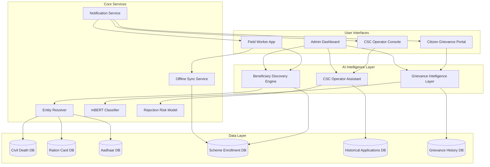

# Design Document: NagarikAI Platform

## Overview

NagarikAI is an AI-Powered Citizen Service Intelligence Platform that transforms the Chhattisgarh e-District ecosystem from basic digitization to intelligent governance. The platform addresses critical gaps in welfare scheme enrollment, grievance handling, and application processing through three integrated AI-powered subsystems.

### System Goals

1. **Proactive Service Delivery**: Identify and enroll eligible citizens before they apply
2. **Intelligent Automation**: Route and escalate grievances using semantic understanding
3. **Quality Assurance**: Validate applications before submission to reduce rejections
4. **Inclusive Access**: Support Hindi, Chhattisgarhi, and voice-based interactions

### Key Design Principles

- **Offline-First**: Field operations must work without connectivity
- **Multilingual**: Support Hindi and Chhattisgarhi throughout
- **Privacy-Preserving**: Encrypt all PII and maintain comprehensive audit trails
- **Performance**: Real-time validation and sub-3-second response times
- **Scalability**: Handle 10,000+ concurrent users with auto-scaling

## Architecture

### High-Level Architecture

The platform follows a microservices architecture with three primary subsystems:



### Subsystem Responsibilities

**Beneficiary Discovery Engine**
- Monitors Civil Death DB for trigger events (deceased ration card holders)
- Uses Entity Resolver to match across disconnected databases
- Creates enrollment cases with confidence scores
- Assigns cases to field workers based on geography

**Grievance Intelligence Layer**
- Classifies grievances using mBERT for Hindi/Chhattisgarhi text
- Routes to appropriate departments based on classification
- Predicts SLA completion times using historical data
- Auto-escalates overdue grievances to supervisory levels

**CSC Operator Assistant**
- Validates application data against eligibility criteria in real-time
- Predicts rejection risk using gradient boosting model
- Provides corrective guidance in Hindi/English
- Supports voice input and audio feedback

### Technology Stack

**Backend Services**
- Language: Python 3.11+
- Framework: FastAPI for REST APIs
- ML Framework: PyTorch for mBERT, XGBoost for rejection risk
- Task Queue: Celery with Redis for async processing
- Cache: Redis for session and prediction caching

**Frontend Applications**
- Field Worker App: React Native for offline-capable mobile
- Web Portals: React with TypeScript
- Voice Interface: Web Speech API with Hindi language pack

**Data Storage**
- Primary DB: PostgreSQL 15+ with PostGIS for geographic queries
- Document Store: MongoDB for unstructured grievance text
- Audit Logs: Elasticsearch for searchable audit trails
- Offline Storage: SQLite on mobile devices with encryption

**Infrastructure**
- Container Orchestration: Kubernetes for auto-scaling
- API Gateway: Kong for rate limiting and authentication
- Monitoring: Prometheus + Grafana for metrics
- Logging: ELK stack (Elasticsearch, Logstash, Kibana)

## Components and Interfaces

### 1. Entity Resolver Component

**Purpose**: Match citizen records across disconnected databases with tolerance for OCR errors and name variations.

**Algorithm**: Multi-stage fuzzy matching pipeline

```python
class EntityResolver:
    def resolve_entity(
        self,
        source_record: Dict[str, Any],
        target_databases: List[str]
    ) -> List[MatchResult]:
        """
        Match a source record against target databases.
        
        Returns ranked list of potential matches with confidence scores.
        """
        pass
    
    def calculate_confidence(
        self,
        field_similarities: Dict[str, float]
    ) -> float:
        """
        Calculate overall match confidence from field-level similarities.
        
        Weighted average: name (0.4), DOB (0.3), address (0.3)
        """
        pass
```

**Matching Stages**:
1. **Exact Match**: Direct comparison on normalized fields
2. **Phonetic Match**: Soundex/Metaphone for name variations
3. **Edit Distance**: Levenshtein distance with OCR error tolerance
4. **Semantic Match**: Address component matching (village, district)

**Performance Requirements**:
- Process 1000 records in < 5 minutes
- Confidence score range: [0.0, 1.0]
- Minimum confidence threshold: 0.7 for auto-enrollment

### 2. mBERT Classifier Component

**Purpose**: Classify Hindi and Chhattisgarhi grievance text into department categories.

**Model Architecture**: Fine-tuned multilingual BERT (bert-base-multilingual-cased)

```python
class GrievanceClassifier:
    def classify(
        self,
        grievance_text: str,
        language: str  # 'hi' or 'chhattisgarhi'
    ) -> ClassificationResult:
        """
        Classify grievance into department category.
        
        Returns category, confidence, and predicted SLA.
        """
        pass
    
    def predict_sla(
        self,
        category: str,
        grievance_features: Dict[str, Any]
    ) -> timedelta:
        """
        Predict resolution time based on category and features.
        """
        pass
```

**Training Data**:
- Historical grievances from Grievance_History_DB
- Minimum 1000 examples per category
- Balanced sampling across departments

**Performance Target**:
- F1 Score: ≥ 0.94 on test set
- Inference time: < 500ms per grievance
- Support 15+ department categories

### 3. Rejection Risk Model Component

**Purpose**: Predict application rejection probability and identify correctable issues.

**Model Architecture**: XGBoost gradient boosting classifier

```python
class RejectionRiskModel:
    def predict_risk(
        self,
        application_data: Dict[str, Any],
        documents: List[Document]
    ) -> RiskAssessment:
        """
        Predict rejection probability and identify issues.
        
        Returns risk score [0-1] and list of correctable issues.
        """
        pass
    
    def explain_prediction(
        self,
        application_data: Dict[str, Any],
        risk_score: float
    ) -> List[CorrectionGuidance]:
        """
        Generate corrective guidance for high-risk applications.
        
        Uses SHAP values for feature importance.
        """
        pass
```

**Features**:
- Document field completeness (binary flags)
- Field mismatch indicators (name, DOB, address)
- Historical rejection patterns for scheme type
- Operator experience level
- Time of day (proxy for operator fatigue)

**Performance Target**:
- AUC: ≥ 0.89 on test set
- Prediction time: < 3 seconds
- Calibrated probabilities (reliability diagram)

### 4. Offline Sync Service

**Purpose**: Enable field workers to operate without connectivity and sync when available.

**Sync Protocol**: Conflict-free Replicated Data Type (CRDT) for eventual consistency

```python
class OfflineSyncService:
    def download_cases(
        self,
        worker_id: str,
        last_sync_timestamp: datetime
    ) -> List[EnrollmentCase]:
        """
        Download new/updated cases for offline work.
        """
        pass
    
    def upload_enrollments(
        self,
        enrollments: List[Enrollment],
        device_id: str
    ) -> SyncResult:
        """
        Upload completed enrollments with conflict resolution.
        
        Retry with exponential backoff on failure.
        """
        pass
```

**Conflict Resolution**:
- Server timestamp wins for status updates
- Merge photo/document uploads (append-only)
- Flag conflicts for manual review if data diverges

**Storage**:
- Mobile: Encrypted SQLite with SQLCipher
- Compression: Gzip for photos before upload
- Batch size: 50 enrollments per sync request

### 5. Notification Service

**Purpose**: Deliver timely notifications across SMS, email, and in-app channels.

```python
class NotificationService:
    def notify_field_worker(
        self,
        worker_id: str,
        case: EnrollmentCase,
        channel: str = 'app'
    ) -> None:
        """
        Notify field worker of new enrollment case.
        
        Delivery within 1 hour of case creation.
        """
        pass
    
    def notify_escalation(
        self,
        grievance_id: str,
        citizen_id: str,
        officer_id: str
    ) -> None:
        """
        Notify both citizen and officer of escalation.
        
        Delivery within 10 minutes of escalation event.
        """
        pass
```

**Channels**:
- In-app: WebSocket push notifications
- SMS: Integration with government SMS gateway
- Email: SMTP with retry logic

**Priority Levels**:
- Critical: Escalations, security alerts (immediate)
- High: New case assignments (within 1 hour)
- Normal: Status updates (within 30 seconds)

## Data Models

### Enrollment Case

```python
@dataclass
class EnrollmentCase:
    case_id: str  # UUID
    beneficiary_name: str
    beneficiary_dob: date
    beneficiary_address: Address
    scheme_type: str  # 'widow_pension', 'disability', etc.
    confidence_score: float  # [0.0, 1.0]
    eligibility_reasoning: str  # Human-readable explanation
    source_records: List[SourceRecord]  # References to matched records
    assigned_worker_id: Optional[str]
    status: str  # 'pending', 'assigned', 'in_progress', 'completed', 'rejected'
    created_at: datetime
    updated_at: datetime
```

### Match Result

```python
@dataclass
class MatchResult:
    source_record_id: str
    target_record_id: str
    target_database: str  # 'civil_death', 'ration_card', 'aadhaar'
    confidence_score: float
    field_similarities: Dict[str, float]  # Per-field similarity scores
    matched_fields: Dict[str, Tuple[Any, Any]]  # (source_value, target_value)
```

### Grievance

```python
@dataclass
class Grievance:
    grievance_id: str  # UUID
    citizen_id: str
    text: str  # Original Hindi/Chhattisgarhi text
    language: str  # 'hi' or 'chhattisgarhi'
    category: str  # Classified department
    classification_confidence: float
    predicted_sla: timedelta
    assigned_department: str
    assigned_officer_id: Optional[str]
    status: str  # 'submitted', 'assigned', 'in_progress', 'resolved', 'escalated'
    escalation_level: int  # 0 = initial, 1+ = escalated
    submitted_at: datetime
    sla_deadline: datetime
    resolved_at: Optional[datetime]
    status_history: List[StatusTransition]
```

### Application Validation

```python
@dataclass
class ApplicationValidation:
    application_id: str
    scheme_type: str
    rejection_risk_score: float  # [0.0, 1.0]
    validation_issues: List[ValidationIssue]
    corrective_guidance: List[CorrectionGuidance]
    validated_at: datetime
    operator_id: str

@dataclass
class ValidationIssue:
    field_name: str
    issue_type: str  # 'missing', 'mismatch', 'invalid_format'
    severity: str  # 'critical', 'high', 'medium', 'low'
    impact_on_risk: float  # Contribution to rejection risk

@dataclass
class CorrectionGuidance:
    issue_id: str
    guidance_text_hindi: str
    guidance_text_english: str
    suggested_action: str
    priority: int  # 1 = highest
```

### Audit Log Entry

```python
@dataclass
class AuditLogEntry:
    log_id: str  # UUID
    timestamp: datetime
    user_id: str
    user_role: str
    action_type: str  # 'login', 'data_access', 'prediction', 'modification'
    resource_type: str  # 'enrollment', 'grievance', 'application'
    resource_id: str
    action_details: Dict[str, Any]
    ip_address: str
    session_id: str
    # For AI predictions
    model_name: Optional[str]
    model_version: Optional[str]
    input_data_hash: Optional[str]  # SHA-256 of input
    prediction_output: Optional[Any]
    confidence_score: Optional[float]
```

### Database Schema Highlights

**Indexes for Performance**:
- `enrollments(status, confidence_score DESC)` - Case prioritization
- `grievances(status, sla_deadline ASC)` - Escalation monitoring
- `audit_logs(user_id, timestamp DESC)` - User activity tracking
- `audit_logs(resource_type, resource_id, timestamp DESC)` - Resource history

**Partitioning Strategy**:
- Audit logs: Partitioned by month for efficient archival
- Grievances: Partitioned by year for historical analysis
- Applications: Partitioned by scheme type for parallel processing

**Encryption**:
- Column-level encryption for PII fields (name, DOB, address, Aadhaar)
- Transparent Data Encryption (TDE) for database files
- Key rotation every 90 days via key management service


## Correctness Properties

*A property is a characteristic or behavior that should hold true across all valid executions of a system-essentially, a formal statement about what the system should do. Properties serve as the bridge between human-readable specifications and machine-verifiable correctness guarantees.*

### Property Reflection

After analyzing all 75 acceptance criteria, I identified the following redundancies and consolidations:

**Redundancy Group 1: Ordering Properties**
- Properties 1.4 (beneficiary ranking), 7.4 (guidance prioritization), and 9.4 (match ranking) all test the same pattern: output lists should be sorted by a score field in descending order. These can be consolidated into a single parameterized property.

**Redundancy Group 2: Offline Round-Trip**
- Properties 2.3 (enrollment sync) and 13.4 (automatic sync) describe the same behavior: offline data should sync to server when connectivity returns. Consolidate into one property.

**Redundancy Group 3: Audit Logging**
- Properties 4.3 (escalation logging), 11.4 (access logging), 14.1 (action logging), and 14.2 (prediction logging) all test that events are logged with required fields. Consolidate into a general audit logging property with specific examples for each event type.

**Redundancy Group 4: Confidence Score Bounds**
- Properties 1.3 (enrollment confidence), 9.3 (match confidence), and 6.3 (rejection risk) all test that scores are in [0,1]. Consolidate into one property about score bounds.

**Redundancy Group 5: Field Presence**
- Properties 2.1 (enrollment case fields), 5.1 (grievance status fields), and 7.2 (validation field highlighting) all test that data structures contain required fields. Consolidate into a schema validation property.

After consolidation, 52 testable properties remain (down from 75 acceptance criteria).

### Beneficiary Discovery Properties

### Property 1: Death Record Triggers Beneficiary Identification

*For any* Civil Death DB record indicating a deceased ration card holder, the Beneficiary Discovery Engine should identify at least one potential widow pension beneficiary with a confidence score.

**Validates: Requirements 1.1**

### Property 2: Entity Resolver Handles Record Variations

*For any* pair of records representing the same person with OCR errors or spelling variations in name/address fields, the Entity Resolver should produce a match with confidence ≥ 0.7.

**Validates: Requirements 1.2, 9.1, 9.2**

### Property 3: Score-Based Ranking Invariant

*For any* list of items with numeric scores (beneficiaries, matches, guidance items), the output list should be sorted by score in descending order, meaning for all adjacent pairs (item_i, item_{i+1}), score_i ≥ score_{i+1}.

**Validates: Requirements 1.4, 7.4, 9.4**

### Property 4: Confidence Scores Are Bounded

*For any* system-generated confidence score (enrollment confidence, match confidence, rejection risk, classification confidence), the value should be in the range [0.0, 1.0].

**Validates: Requirements 1.3, 6.3, 9.3**

### Property 5: Required Fields Present in Data Structures

*For any* enrollment case, the data structure should contain all required fields: case_id, beneficiary_name, beneficiary_dob, beneficiary_address, scheme_type, confidence_score, eligibility_reasoning, status, created_at, updated_at.

**Validates: Requirements 2.1**

### Property 6: Offline Data Capture and Sync Round-Trip

*For any* beneficiary enrollment data captured offline, after synchronization completes successfully, querying the Scheme_Enrollment_DB should return an enrollment record with equivalent data.

**Validates: Requirements 2.2, 2.3, 13.1, 13.2, 13.4**

### Grievance Intelligence Properties

### Property 7: Grievance Classification Produces Category

*For any* valid Hindi or Chhattisgarhi grievance text, the mBERT Classifier should produce a classification result containing a department category and a confidence score in [0,1].

**Validates: Requirements 3.1**

### Property 8: Routing Matches Classification

*For any* classified grievance, the assigned department should correspond to the classification category according to the department mapping.

**Validates: Requirements 3.3**

### Property 9: SLA Prediction Is Positive Duration

*For any* routed grievance, the predicted SLA completion time should be a positive time duration (> 0 seconds).

**Validates: Requirements 3.4**

### Property 10: Escalation Warning at 80% SLA

*For any* grievance that has consumed 80% or more of its predicted SLA without resolution, a warning notification should be sent to the assigned officer.

**Validates: Requirements 4.1**

### Property 11: SLA Breach Triggers Escalation

*For any* grievance that exceeds its predicted SLA deadline without resolution, the escalation_level should increment by 1 and a new officer at the next supervisory level should be assigned.

**Validates: Requirements 4.2**

### Property 12: Status History Completeness

*For any* grievance with status changes, the status_history list should contain all transitions in chronological order, with each transition including timestamp, old_status, new_status, and actor_id.

**Validates: Requirements 5.4**

### Property 13: Time Remaining Calculation

*For any* grievance with a predicted SLA deadline, the displayed time remaining should equal max(0, sla_deadline - current_time).

**Validates: Requirements 5.2**

### CSC Operator Assistant Properties

### Property 14: Validation Produces Results

*For any* application data entered by an operator, validation should produce a result containing a rejection_risk_score and a list of validation_issues (which may be empty).

**Validates: Requirements 6.1**

### Property 15: Mismatch Detection

*For any* application where document field values do not match eligibility criteria (e.g., age < minimum_age, income > threshold), the validation_issues list should contain at least one issue identifying the mismatched field.

**Validates: Requirements 6.2**

### Property 16: Guidance Provided for Issues

*For any* validation issue with severity 'critical' or 'high', the corrective_guidance list should contain at least one guidance item in both Hindi and English addressing that issue.

**Validates: Requirements 7.1, 7.3**

### Property 17: Guidance Identifies Specific Fields

*For any* validation issue, the corresponding corrective guidance should reference the specific field_name that requires correction.

**Validates: Requirements 7.2**

### Property 18: Voice Command Visual Confirmation

*For any* voice command recognized by the CSC Operator Console, a visual confirmation message should be displayed containing the recognized command text.

**Validates: Requirements 8.4**

### Entity Resolution Properties

### Property 19: Match Confidence Calculation

*For any* match result, the overall confidence_score should be a weighted average of field_similarities with weights: name (0.4), DOB (0.3), address (0.3), and the result should be in [0,1].

**Validates: Requirements 9.1, 9.3**

### Model Training and Updates Properties

### Property 20: Model Rollback on Performance Degradation

*For any* retrained model that achieves lower performance metrics (F1 score or AUC) than the currently deployed model on the validation set, the system should retain the current model and not deploy the new model.

**Validates: Requirements 10.5**

### Security and Privacy Properties

### Property 21: PII Encryption at Rest

*For any* personally identifiable information field (name, DOB, address, Aadhaar number) stored in the database, the stored value should be encrypted using AES-256, meaning the raw database value should not equal the plaintext value.

**Validates: Requirements 11.1**

### Property 22: Role-Based Access Control Enforcement

*For any* database operation, if the requesting user's role does not have permission for that operation on that resource type, the operation should be rejected with an authorization error.

**Validates: Requirements 11.3**

### Property 23: Comprehensive Audit Logging

*For any* system event (user action, data access, model prediction, escalation), an audit log entry should be created containing: log_id, timestamp, user_id, action_type, resource_type, resource_id, and action_details.

**Validates: Requirements 4.3, 11.4, 14.1, 14.2**

### Offline Capability Properties

### Property 24: Offline Data Encryption

*For any* enrollment data stored offline on a mobile device, the stored data should be encrypted, meaning reading the raw SQLite file should not reveal plaintext PII.

**Validates: Requirements 13.3**

### Property 25: Sync Retry with Exponential Backoff

*For any* failed synchronization attempt, the system should retry with exponentially increasing delays (e.g., 1s, 2s, 4s, 8s, 16s) up to a maximum of 5 attempts before giving up.

**Validates: Requirements 13.5**

### Analytics and Reporting Properties

### Property 26: Audit Log Search Correctness

*For any* audit log search query with filters (user_id, date_range, action_type), all returned log entries should match the filter criteria, and no matching entries should be omitted (up to pagination limits).

**Validates: Requirements 14.4**

### Property 27: Compliance Report Completeness

*For any* compliance report generated for a time period, the report should include all required metrics: total user actions, total predictions, model performance metrics (F1, AUC), and data access counts.

**Validates: Requirements 14.5**

### Property 28: Dashboard Metrics Presence

*For any* date, the dashboard data should include: enrollment_count, grievance_resolution_rate, and application_approval_rate, with each metric being a non-negative number.

**Validates: Requirements 15.1**

### Property 29: Trend Calculation Correctness

*For any* time series of daily metrics, the weekly aggregation should equal the sum (for counts) or average (for rates) of the 7 daily values in that week.

**Validates: Requirements 15.2**

### Property 30: Geographic Data Availability

*For any* entity (beneficiary, grievance, application) with a valid address containing district and village, the entity should appear in geographic distribution queries for that location.

**Validates: Requirements 15.3**

### Property 31: Export Format Validity

*For any* analytics data exported to CSV format, the output should be valid CSV (parseable by standard CSV parsers) with headers matching the data fields.

**Validates: Requirements 15.4**


## Error Handling

### Error Categories

**1. Data Quality Errors**
- Missing or malformed records in source databases
- OCR errors exceeding tolerance thresholds
- Incomplete beneficiary information

**Strategy**: 
- Log data quality issues with source record IDs
- Flag cases for manual review when confidence < 0.7
- Provide data quality reports to database administrators

**2. Model Prediction Errors**
- Classification confidence below threshold (< 0.5)
- Unexpected input formats (non-Hindi/Chhattisgarhi text)
- Model inference failures

**Strategy**:
- Fall back to rule-based routing for low-confidence classifications
- Return error responses with actionable messages
- Alert ML team when error rate exceeds 5% over 1 hour

**3. Network and Connectivity Errors**
- API timeouts during sync operations
- Database connection failures
- External service unavailability

**Strategy**:
- Implement exponential backoff with jitter for retries
- Cache recent data for offline operation
- Degrade gracefully (e.g., disable real-time features, use cached predictions)

**4. Authorization and Security Errors**
- Unauthorized access attempts
- Invalid authentication tokens
- Role permission violations

**Strategy**:
- Return 401/403 HTTP status codes with generic error messages
- Log security events with full context for investigation
- Trigger alerts for repeated unauthorized access attempts (> 5 in 10 minutes)


**5. Data Synchronization Errors**
- Conflicting updates from multiple devices
- Partial sync failures
- Data corruption during transmission

**Strategy**:
- Use CRDT (Conflict-free Replicated Data Types) for automatic conflict resolution
- Implement checksums to detect corruption
- Maintain sync state to resume from last successful point
- Flag unresolvable conflicts for manual review

**6. Resource Exhaustion Errors**
- Database connection pool exhaustion
- Memory limits exceeded during batch processing
- Disk space exhaustion for audit logs

**Strategy**:
- Implement circuit breakers to prevent cascade failures
- Use streaming for large batch operations
- Trigger auto-scaling before hitting 80% capacity
- Implement log rotation and archival policies

### Error Response Format

All API errors follow a consistent JSON structure:

```json
{
  "error": {
    "code": "VALIDATION_FAILED",
    "message": "Application validation failed",
    "message_hi": "आवेदन सत्यापन विफल रहा",
    "details": {
      "field": "date_of_birth",
      "issue": "Age below minimum requirement"
    },
    "request_id": "req_abc123",
    "timestamp": "2024-01-15T10:30:00Z"
  }
}
```

### Monitoring and Alerting

**Critical Alerts** (immediate notification):
- Model inference failure rate > 10%
- Database unavailability
- Security breach detection
- Auto-scaling failure

**Warning Alerts** (15-minute aggregation):
- API response time > 5 seconds (95th percentile)
- Sync failure rate > 5%
- Disk usage > 80%
- Error rate > 1% for any endpoint


## Testing Strategy

### Dual Testing Approach

The NagarikAI platform requires both unit testing and property-based testing for comprehensive coverage:

**Unit Tests**: Verify specific examples, edge cases, and error conditions
- Specific grievance classification examples (known Hindi/Chhattisgarhi texts)
- Edge cases: empty input, malformed data, boundary values
- Error conditions: network failures, invalid tokens, missing fields
- Integration points: database connections, external API calls

**Property Tests**: Verify universal properties across all inputs
- Universal properties that hold for all valid inputs
- Comprehensive input coverage through randomization
- Catch unexpected edge cases through fuzzy testing
- Validate invariants and mathematical properties

Together, unit tests catch concrete bugs while property tests verify general correctness.

### Property-Based Testing Configuration

**Framework Selection**:
- Python: Hypothesis (https://hypothesis.readthedocs.io/)
- JavaScript/TypeScript: fast-check (https://fast-check.dev/)

**Test Configuration**:
- Minimum 100 iterations per property test (due to randomization)
- Seed-based reproducibility for failed test cases
- Shrinking enabled to find minimal failing examples
- Timeout: 60 seconds per property test

**Test Tagging**:
Each property test must reference its design document property using a comment tag:

```python
# Feature: nagarik-ai-platform, Property 1: Death Record Triggers Beneficiary Identification
@given(civil_death_records())
def test_death_record_triggers_identification(record):
    beneficiaries = discovery_engine.identify_beneficiaries(record)
    assert len(beneficiaries) > 0
    assert all(0 <= b.confidence_score <= 1 for b in beneficiaries)
```


### Test Data Generators

**Custom Generators for Domain Objects**:

```python
from hypothesis import strategies as st

@st.composite
def civil_death_records(draw):
    """Generate realistic civil death records with ration card references."""
    return {
        'death_id': draw(st.uuids()),
        'deceased_name': draw(st.text(alphabet=hindi_chars, min_size=3, max_size=50)),
        'death_date': draw(st.dates(min_value=date(2020, 1, 1))),
        'ration_card_id': draw(st.text(alphabet=string.digits, min_size=10, max_size=10)),
        'address': draw(addresses())
    }

@st.composite
def grievance_texts(draw, language='hi'):
    """Generate Hindi/Chhattisgarhi grievance texts."""
    templates = [
        "मेरा राशन कार्ड {days} दिनों से लंबित है",
        "पेंशन भुगतान {months} महीनों से नहीं मिला",
        # ... more templates
    ]
    template = draw(st.sampled_from(templates))
    return template.format(
        days=draw(st.integers(min_value=1, max_value=365)),
        months=draw(st.integers(min_value=1, max_value=12))
    )

@st.composite
def applications_with_mismatches(draw):
    """Generate applications with known validation issues."""
    app = draw(valid_applications())
    # Introduce intentional mismatches
    if draw(st.booleans()):
        app['age'] = draw(st.integers(min_value=1, max_value=17))  # Below minimum
    if draw(st.booleans()):
        app['income'] = draw(st.integers(min_value=500000, max_value=1000000))  # Above threshold
    return app
```

### Unit Test Coverage Requirements

**Minimum Coverage Targets**:
- Line coverage: 80%
- Branch coverage: 75%
- Critical paths (security, data integrity): 95%

**Priority Test Areas**:
1. Entity resolution matching logic
2. Grievance classification and routing
3. Rejection risk prediction
4. Offline sync conflict resolution
5. Encryption/decryption operations
6. Role-based access control
7. Audit logging completeness


### Integration Testing

**Database Integration**:
- Use test containers (Testcontainers) for PostgreSQL and MongoDB
- Seed with realistic test data (anonymized production data)
- Test migrations and schema changes
- Verify index performance on large datasets

**ML Model Integration**:
- Mock model predictions for fast unit tests
- Use small pre-trained models for integration tests
- Test model loading and inference pipeline
- Verify prediction caching behavior

**External Service Integration**:
- Mock external APIs (SMS gateway, Aadhaar verification)
- Test retry logic and timeout handling
- Verify circuit breaker behavior
- Test graceful degradation when services unavailable

### Performance Testing

**Load Testing Scenarios**:
1. 10,000 concurrent users on Citizen Grievance Portal
2. 1,000 CSC operators validating applications simultaneously
3. 500 field workers syncing offline data concurrently
4. Batch processing 10,000 death records for beneficiary discovery

**Performance Benchmarks**:
- API response time: p95 < 3 seconds, p99 < 5 seconds
- Entity resolution: 1000 records in < 5 minutes
- Grievance classification: < 500ms per grievance
- Application validation: < 3 seconds per application
- Dashboard query: < 2 seconds for 30-day aggregations

**Tools**:
- Load testing: Locust or k6
- Profiling: py-spy for Python, Chrome DevTools for frontend
- Database query analysis: EXPLAIN ANALYZE in PostgreSQL

### Security Testing

**Automated Security Scans**:
- SAST (Static Application Security Testing): Bandit for Python
- Dependency vulnerability scanning: Snyk or Dependabot
- Container scanning: Trivy for Docker images
- API security testing: OWASP ZAP

**Manual Security Review**:
- Penetration testing before production deployment
- Code review for authentication and authorization logic
- Encryption implementation review
- Audit log completeness verification

### Continuous Integration Pipeline

**CI Stages**:
1. Lint and format check (Black, ESLint)
2. Unit tests with coverage report
3. Property-based tests (100 iterations)
4. Integration tests with test containers
5. Security scans
6. Build Docker images
7. Deploy to staging environment
8. Run smoke tests

**Quality Gates**:
- All tests must pass
- Code coverage ≥ 80%
- No critical security vulnerabilities
- No linting errors
- Performance benchmarks within 10% of baseline


---

## CSC Operator Assistant Enhancements (Requirements 16–21)

*The following sections extend the existing CSC Operator Assistant design to cover local NLP anomaly detection, rejection pattern analysis, privacy-preserving eligibility inference, multilingual guidance, application triage, and graceful degradation.*

### New Components and Interfaces

#### 6. Local_NLP_Model Component

**Purpose**: Lightweight NLP model embedded on the operator device that parses form field values and flags anomalies without a network connection.

**Model Architecture**: Quantized transformer (e.g., DistilBERT INT8 or a rule-augmented TF-Lite model) small enough to run on a mid-range Android/desktop device with < 200 MB footprint.

```python
class LocalNLPModel:
    def parse_field(
        self,
        field_name: str,
        field_value: str,
        scheme_type: str,
        context: Dict[str, Any]  # Other field values for cross-field checks
    ) -> FieldParseResult:
        """
        Parse a single form field value and detect anomalies.

        Returns parsed value, normalized form, and any anomaly flags.
        Runs entirely on-device; no network call required.
        """
        pass

    def detect_anomalies(
        self,
        application_data: Dict[str, Any],
        scheme_type: str
    ) -> List[FieldAnomaly]:
        """
        Scan all fields in an application for format errors,
        implausible values, and cross-field inconsistencies.
        """
        pass

    def supported_schemes(self) -> List[str]:
        """Return list of scheme types covered by this model version."""
        pass
```

**Anomaly Types Detected**:
- Format errors: Aadhaar not 12 digits, date not parseable, bank account out of range
- Implausible values: age < 0 or > 120, income negative, future date of birth
- Cross-field inconsistencies: age derived from DOB does not match stated age field; scheme minimum age not met

**Deployment**:
- Bundled with the CSC Operator Console installer; updated during each successful online sync
- Model version and checksum stored in `OfflineCacheManifest`
- Inference time target: < 200 ms per field on a 2 GHz device

#### 7. Rejection_Pattern_Analyzer Component

**Purpose**: Aggregate historical rejection outcomes to compute per-field, per-scheme rejection frequency scores and surface them in the dashboard and inline form hints.

```python
class RejectionPatternAnalyzer:
    def compute_rejection_frequencies(
        self,
        scheme_type: Optional[str] = None
    ) -> List[RejectionPattern]:
        """
        Aggregate Historical_Applications_DB to compute rejection_frequency_score
        per (field_name, scheme_type) pair.

        rejection_frequency_score = rejected_count / total_count for that pair.
        Refreshed at least every 24 hours.
        """
        pass

    def get_high_risk_fields(
        self,
        scheme_type: str,
        threshold: float = 0.3
    ) -> List[RejectionPattern]:
        """
        Return fields whose rejection_frequency_score exceeds threshold
        for the given scheme type, sorted descending by score.
        """
        pass

    def export_csv(self, scheme_type: str) -> str:
        """Export rejection pattern data for a scheme type as CSV string."""
        pass
```

**Refresh Strategy**:
- Background job runs every 24 hours (or on-demand by supervisor)
- Results cached in Redis with TTL = 25 hours (5-hour buffer)
- Last refresh timestamp stored alongside each `RejectionPattern` record

#### 8. Eligibility_Inference_Engine Component

**Purpose**: Extract eligibility-relevant metadata from uploaded documents and infer a pre-submission eligibility signal without persisting raw document data.

```python
class EligibilityInferenceEngine:
    def extract_metadata(
        self,
        document_bytes: bytes,
        document_type: str
    ) -> DocumentMetadata:
        """
        Extract eligibility-relevant fields from a document:
        document_type, issue_date, issuing_authority, validity_status.

        Raw bytes are NOT stored; only the returned metadata struct is retained
        for the duration of the active session.
        """
        pass

    def infer_eligibility(
        self,
        metadata: DocumentMetadata,
        scheme_type: str
    ) -> EligibilitySignal:
        """
        Infer pre-submission eligibility from metadata using the
        Rejection_Risk_Model feature set.

        Returns eligibility_status ('eligible', 'ineligible', 'uncertain')
        and reason in Hindi and English if ineligible.
        """
        pass

    def discard_session_data(self, session_id: str) -> None:
        """
        Purge all raw document data and intermediate OCR text
        associated with session_id from in-process memory.
        Called on session closure or form reset; must complete within 60 s.
        """
        pass
```

**Privacy Guarantees**:
- Raw document bytes are never written to disk or any database
- OCR intermediate text is held only in process memory for the active session
- Only `DocumentMetadata` (derived fields) and anonymized eligibility signals are persisted
- `discard_session_data` is called by a watchdog timer 60 seconds after session closure

#### 9. Guidance_Interface Component

**Purpose**: In-form overlay providing voice and text chat guidance in Hindi and Chhattisgarhi without requiring the operator to leave the active form.

```python
class GuidanceInterface:
    def handle_query(
        self,
        query_text: str,
        intent: str,  # 'field_definition' | 'document_list' | 'eligibility_criteria' | 'rejection_reasons'
        active_field: str,
        scheme_type: str,
        language: str  # 'hi' | 'chhattisgarhi'
    ) -> GuidanceResponse:
        """
        Return contextually relevant guidance for the active field and scheme.
        Response language matches the operator's preferred language setting.
        Target latency: < 3 seconds.
        """
        pass

    def transcribe_voice(
        self,
        audio_bytes: bytes,
        language: str
    ) -> TranscriptionResult:
        """
        Transcribe voice input to text within 2 seconds.
        Returns transcription text for operator confirmation before processing.
        """
        pass
```

**Supported Intents**:
| Intent | Description |
|---|---|
| `field_definition` | Explains what a form field means and acceptable values |
| `document_list` | Lists required documents for the active scheme |
| `eligibility_criteria` | Summarizes eligibility rules for the active scheme |
| `rejection_reasons` | Lists the most common rejection reasons for the active scheme |

**Overlay Behavior**: The Guidance_Interface renders as a slide-in panel anchored to the right side of the form. It does not replace the form view; the operator can interact with both simultaneously.

#### 10. Stall_Risk_Predictor Component

**Purpose**: Compute a `Stall_Risk_Score` for each in-progress application and maintain the `Triage_Queue` of high-risk applications.

```python
class StallRiskPredictor:
    def compute_stall_risk(
        self,
        application_id: str,
        application_data: Dict[str, Any],
        validation_issues: List[ValidationIssue],
        scheme_type: str
    ) -> StallRiskAssessment:
        """
        Compute Stall_Risk_Score in [0, 1] using:
        - Historical processing patterns for this scheme type
        - Count and severity of current validation issues
        - Scheme-specific SLA data (average processing time, rejection rate)

        Returns score, primary stall reason in Hindi and English,
        and timestamp of computation.
        """
        pass

    def get_triage_queue(
        self,
        threshold: float = 0.6
    ) -> List[StallRiskAssessment]:
        """
        Return all in-progress applications with Stall_Risk_Score > threshold,
        sorted by score descending.
        """
        pass

    def refresh_all(self) -> int:
        """
        Recompute Stall_Risk_Score for all in-progress applications.
        Called at least every 30 minutes by a background scheduler.
        Returns count of applications updated.
        """
        pass
```

**Feature Inputs**:
- Number and severity of open validation issues
- Time elapsed since application was opened
- Scheme-type historical average processing time
- Operator's historical first-time approval rate
- Whether required documents have been uploaded

#### 11. Offline_Cache_Manager Component

**Purpose**: Manage the lifecycle of locally cached models and data, enforce Lite_Mode transitions, and coordinate deferred sync.

```python
class OfflineCacheManager:
    def get_cache_manifest(self) -> OfflineCacheManifest:
        """Return current cache state including model version and last sync time."""
        pass

    def is_cache_stale(self, max_age_hours: int = 72) -> bool:
        """Return True if last_sync_timestamp is older than max_age_hours."""
        pass

    def get_connectivity_mode(
        self,
        current_bandwidth_kbps: float
    ) -> str:
        """
        Return 'Online', 'Lite_Mode', or 'Offline' based on bandwidth.
        Lite_Mode: bandwidth < 50 kbps and > 0.
        Offline: no connectivity.
        """
        pass

    def sync_deferred_data(self) -> SyncResult:
        """
        Upload deferred API calls and download fresh model/pattern data.
        Called automatically when bandwidth rises above 50 kbps.
        Must complete within 60 seconds.
        """
        pass

    def apply_staleness_penalty(
        self,
        raw_confidence: float
    ) -> float:
        """
        If cache is stale (> 72 h), return raw_confidence - 0.10.
        Otherwise return raw_confidence unchanged.
        Clamps result to [0.0, 1.0].
        """
        pass
```

**Lite_Mode Behavior**:
- Disabled: real-time dashboard charts, non-critical analytics API calls, model update downloads
- Enabled: field anomaly detection (Local_NLP_Model), eligibility inference (cached), corrective guidance (cached), Triage_Queue (cached scores)

---

### New Data Models

#### RejectionPattern

```python
@dataclass
class RejectionPattern:
    pattern_id: str          # UUID
    field_name: str          # Form field identifier
    scheme_type: str         # e.g., 'widow_pension'
    total_applications: int  # Total applications for this (field, scheme) pair
    rejected_count: int      # Applications rejected due to this field
    rejection_frequency_score: float  # rejected_count / total_applications, in [0, 1]
    last_refreshed: datetime # Timestamp of last aggregation run
    sample_rejection_reasons: List[str]  # Top 3 human-readable reasons
```

#### StallRiskAssessment

```python
@dataclass
class StallRiskAssessment:
    assessment_id: str       # UUID
    application_id: str
    scheme_type: str
    stall_risk_score: float  # [0, 1]
    primary_stall_reason_hindi: str
    primary_stall_reason_english: str
    contributing_factors: List[str]  # Feature names driving the score
    computed_at: datetime
    is_in_triage_queue: bool  # True if score > 0.6
```

#### GuidanceQuery / GuidanceResponse

```python
@dataclass
class GuidanceQuery:
    query_id: str
    session_id: str
    operator_id: str
    query_text: str
    intent: str          # 'field_definition' | 'document_list' | 'eligibility_criteria' | 'rejection_reasons'
    active_field: str
    scheme_type: str
    language: str        # 'hi' | 'chhattisgarhi'
    input_mode: str      # 'text' | 'voice'
    submitted_at: datetime

@dataclass
class GuidanceResponse:
    query_id: str
    response_text: str   # In operator's preferred language
    referenced_field: str
    referenced_scheme: str
    confidence: float    # [0, 1]
    sources: List[str]   # e.g., ['scheme_rules_v2', 'rejection_pattern_cache']
    responded_at: datetime
    latency_ms: int
```

#### DocumentMetadata

```python
@dataclass
class DocumentMetadata:
    metadata_id: str       # UUID, session-scoped
    session_id: str
    document_type: str     # e.g., 'death_certificate', 'income_certificate'
    issue_date: Optional[date]
    issuing_authority: Optional[str]
    validity_status: str   # 'valid' | 'expired' | 'unknown'
    # NOTE: No raw image bytes or OCR text stored here
    extracted_at: datetime
```

#### OfflineCacheManifest

```python
@dataclass
class OfflineCacheManifest:
    manifest_id: str
    device_id: str
    local_nlp_model_version: str
    local_nlp_model_checksum: str   # SHA-256
    rejection_patterns_version: str
    last_sync_timestamp: datetime
    cache_size_mb: float
    is_stale: bool                  # True if last_sync > 72 hours ago
    connectivity_mode: str          # 'Online' | 'Lite_Mode' | 'Offline'
```

---

### Correctness Properties (Requirements 16–21)

*Continuing from Property 31. Properties are derived from the acceptance criteria prework analysis above.*

### Property 32: Local NLP Anomaly Detection Coverage

*For any* form field value that is anomalous (wrong format, implausible value, or cross-field inconsistency) and any supported scheme type, the `Local_NLP_Model.detect_anomalies` function should return at least one `FieldAnomaly` entry referencing the specific `field_name` that contains the anomaly.

**Validates: Requirements 16.1, 16.2, 16.3, 16.4**

### Property 33: Local NLP Scheme Coverage

*For any* scheme type in the list returned by `LocalNLPModel.supported_schemes()`, calling `detect_anomalies` with a valid application for that scheme should return a result (not raise an error or return `None`), confirming full scheme coverage.

**Validates: Requirements 16.4**

### Property 34: Offline-to-Online Risk Score Reconciliation

*For any* application that has local anomaly flags computed offline, after `sync_deferred_data` completes successfully, the `rejection_risk_score` returned by the server-side `Rejection_Risk_Model` should be greater than or equal to the offline-only score when the same issues are present (server has at least as much information).

**Validates: Requirements 16.5**

### Property 35: Rejection Frequency Score Correctness

*For any* set of historical application outcomes grouped by `(field_name, scheme_type)`, the computed `rejection_frequency_score` should equal `rejected_count / total_applications`, and the value should be in `[0.0, 1.0]`.

**Validates: Requirements 17.1**

### Property 36: Rejection Pattern Dashboard Ordering

*For any* scheme type, the list returned by `get_high_risk_fields` (and displayed in the Rejection_Pattern_Dashboard) should be sorted in descending order by `rejection_frequency_score`, meaning for all adjacent pairs `(p_i, p_{i+1})`, `p_i.rejection_frequency_score >= p_{i+1}.rejection_frequency_score`, and the list should contain at most 10 entries.

**Validates: Requirements 17.2**

### Property 37: High-Risk Field Highlighting Threshold

*For any* field with `rejection_frequency_score > 0.3` for the active scheme type, that field should appear in the set returned by `get_high_risk_fields(scheme_type, threshold=0.3)`. Conversely, no field with `rejection_frequency_score <= 0.3` should appear in that set.

**Validates: Requirements 17.3**

### Property 38: Rejection Pattern Data Freshness

*For any* `RejectionPattern` record in the system, `last_refreshed` should be no more than 24 hours before the current time, ensuring statistics are never stale beyond the refresh window.

**Validates: Requirements 17.4**

### Property 39: Rejection Pattern CSV Round-Trip

*For any* set of `RejectionPattern` records for a given scheme type, exporting via `export_csv` and parsing the result with a standard CSV parser should yield records with equivalent `field_name`, `scheme_type`, and `rejection_frequency_score` values.

**Validates: Requirements 17.5**

### Property 40: Document Metadata Extraction Completeness

*For any* uploaded document of a supported type, `extract_metadata` should return a `DocumentMetadata` struct containing non-null values for `document_type`, `issue_date`, `issuing_authority`, and `validity_status`.

**Validates: Requirements 18.1**

### Property 41: Ineligibility Reason Bilingual Completeness

*For any* document metadata that causes `infer_eligibility` to return `eligibility_status = 'ineligible'`, the returned `EligibilitySignal` should contain non-empty ineligibility reason strings in both Hindi and English.

**Validates: Requirements 18.3**

### Property 42: Raw Document Data Non-Persistence

*For any* completed or reset session, querying the database for records associated with that `session_id` should return no rows containing raw image bytes or raw OCR text fields, confirming that only derived `DocumentMetadata` is stored.

**Validates: Requirements 18.4, 18.5**

### Property 43: Guidance Response Contextual Reference

*For any* query submitted to `GuidanceInterface.handle_query`, the returned `GuidanceResponse` should have `referenced_field` equal to the `active_field` parameter and `referenced_scheme` equal to the `scheme_type` parameter, confirming contextual relevance.

**Validates: Requirements 19.2**

### Property 44: Guidance Intent Coverage

*For any* of the four supported intents (`field_definition`, `document_list`, `eligibility_criteria`, `rejection_reasons`) and any supported scheme type, `handle_query` should return a `GuidanceResponse` with non-empty `response_text`.

**Validates: Requirements 19.3**

### Property 45: Guidance Language Fidelity

*For any* query where `language` is set to `'hi'` or `'chhattisgarhi'`, the `response_text` in the returned `GuidanceResponse` should be in the requested language (detectable by script/language identification), not in English.

**Validates: Requirements 19.6**

### Property 46: Stall Risk Score Bounds

*For any* in-progress application, `StallRiskPredictor.compute_stall_risk` should return a `StallRiskAssessment` where `stall_risk_score` is in `[0.0, 1.0]`.

**Validates: Requirements 20.1**

### Property 47: Triage Queue Threshold and Ordering

*For any* set of in-progress applications, `get_triage_queue(threshold=0.6)` should return exactly those applications with `stall_risk_score > 0.6`, sorted in descending order by `stall_risk_score`.

**Validates: Requirements 20.2**

### Property 48: Triage Queue Bilingual Stall Reason

*For any* `StallRiskAssessment` in the Triage_Queue, both `primary_stall_reason_hindi` and `primary_stall_reason_english` should be non-empty strings.

**Validates: Requirements 20.3**

### Property 49: Stall Risk Score Freshness

*For any* in-progress application, the `computed_at` timestamp on its `StallRiskAssessment` should be no more than 30 minutes before the current time.

**Validates: Requirements 20.4**

### Property 50: Triage Queue Removal After Resolution

*For any* application that was in the Triage_Queue, after the operator resolves the flagged issue and `refresh_all` is called, `get_triage_queue` should not contain that application (assuming the resolved score drops to ≤ 0.6).

**Validates: Requirements 20.5**

### Property 51: Offline Cache Validity Window

*For any* `OfflineCacheManifest` where `is_stale = False` (i.e., `last_sync_timestamp` is within 72 hours), calling `Local_NLP_Model.detect_anomalies` and `EligibilityInferenceEngine.infer_eligibility` should return results without network errors, confirming full offline capability within the validity window.

**Validates: Requirements 21.1**

### Property 52: Lite_Mode Activation Threshold

*For any* bandwidth measurement below 50 kbps, `OfflineCacheManager.get_connectivity_mode` should return `'Lite_Mode'` (or `'Offline'` if bandwidth is 0). For any bandwidth at or above 50 kbps, it should return `'Online'`.

**Validates: Requirements 21.2, 21.5**

### Property 53: Core Features Available in Lite_Mode

*For any* system state where `connectivity_mode = 'Lite_Mode'`, the three core functions — field anomaly detection, pre-submission eligibility inference, and corrective guidance — should each return a valid result using cached models, not an error or empty response.

**Validates: Requirements 21.3**

### Property 54: Staleness Confidence Penalty

*For any* raw prediction confidence `c` in `[0.0, 1.0]` when the cache is stale (older than 72 hours), `apply_staleness_penalty(c)` should return `max(0.0, c - 0.10)`, and when the cache is fresh, it should return `c` unchanged.

**Validates: Requirements 21.6**

---

### Error Handling Additions (Offline and Degraded Modes)

**7. Local Model Inference Errors**

Scenarios:
- `Local_NLP_Model` fails to load from cache (corrupted file, checksum mismatch)
- Inference exceeds 200 ms timeout on low-end device
- Unsupported scheme type passed to model

Strategy:
- On load failure: display a non-blocking warning banner; fall back to rule-based field validation (regex patterns for Aadhaar, date formats, etc.)
- On timeout: return partial results for fields already processed; log timeout with device specs
- On unsupported scheme: return an empty anomaly list with a `model_coverage_warning` flag; do not block form submission

**8. Rejection Pattern Staleness**

Scenarios:
- Background refresh job fails (database unavailable, network timeout)
- Cached patterns exceed 24-hour TTL before refresh completes

Strategy:
- Serve stale patterns with a `data_freshness_warning` flag in the API response
- Log refresh failure with error details; retry after 1 hour
- If patterns are more than 48 hours old, disable inline field highlighting and show a supervisor alert

**9. Document Metadata Extraction Failures**

Scenarios:
- Uploaded document is unreadable (corrupted, unsupported format)
- OCR confidence below threshold (< 0.6) for a required metadata field
- Session watchdog fires before extraction completes

Strategy:
- Return a partial `DocumentMetadata` with `validity_status = 'unknown'` for unextractable fields
- Display a field-level warning asking the operator to verify the document manually
- Watchdog always fires `discard_session_data` regardless of extraction state; partial data is discarded

**10. Guidance Interface Unavailability**

Scenarios:
- Guidance backend unreachable (offline or Lite_Mode with no cached responses)
- Voice transcription service unavailable

Strategy:
- In Lite_Mode/Offline: serve cached guidance responses for the most common intents per scheme type (pre-populated during last sync)
- If no cached response exists for a query: return a fallback message in Hindi and English directing the operator to the printed scheme guidelines
- Voice transcription failure: fall back to text input mode; display a non-blocking notification

**11. Stall Risk Computation Errors**

Scenarios:
- Historical pattern data unavailable for a scheme type
- Stall risk model fails to load

Strategy:
- Return `stall_risk_score = null` with a `computation_unavailable` flag; do not surface the application in the Triage_Queue
- Log the failure; alert the ML team if error rate exceeds 10% of applications over 1 hour
- Triage_Queue displays a banner when scores are partially unavailable

**Error Response Extensions**

New error codes added to the standard error response format:

```json
{
  "error": {
    "code": "LOCAL_MODEL_LOAD_FAILED",
    "message": "Local NLP model could not be loaded from cache",
    "message_hi": "स्थानीय NLP मॉडल कैश से लोड नहीं हो सका",
    "details": {
      "model_version": "v2.1.0",
      "checksum_expected": "abc123",
      "checksum_actual": "def456"
    },
    "fallback_active": true,
    "request_id": "req_xyz789",
    "timestamp": "2024-01-15T10:30:00Z"
  }
}
```

Additional error codes:
- `LOCAL_MODEL_LOAD_FAILED` — model file corrupted or checksum mismatch
- `REJECTION_PATTERN_STALE` — cached patterns exceed TTL
- `DOCUMENT_EXTRACTION_PARTIAL` — one or more metadata fields could not be extracted
- `GUIDANCE_CACHE_MISS` — no cached guidance available for the requested intent/scheme
- `STALL_RISK_UNAVAILABLE` — stall risk model or historical data unavailable
- `CACHE_STALE_72H` — offline cache older than 72 hours; confidence penalty applied
- `LITE_MODE_ACTIVATED` — system switched to Lite_Mode due to low bandwidth
