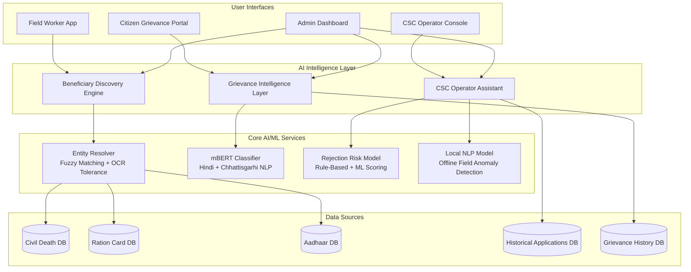

# NagarikAI — Hackathon 2026 Presentation

**Team blueBox | Chhattisgarh NIC Smart Governance Initiative | AI & ML Track**

---

## Slide 1: Title

**NagarikAI**
*AI-Powered Citizen Service Intelligence Platform*

> "Moving from digitization to intelligent governance"

- Team: blueBox
- Event: Hackathon 2026 — Chhattisgarh NIC Smart Governance Initiative
- Track: AI & ML Track
- Target: Chhattisgarh e-District Ecosystem

---

## Slide 2: The Problem

The Chhattisgarh e-District portal is digitized — but not intelligent.

**Pain Point 1 — Invisible Beneficiaries**
Eligible citizens remain unenrolled because welfare databases (Civil Death Records, Ration Cards, Aadhaar) are siloed. A widow whose husband died may never know she qualifies for a pension.

**Pain Point 2 — Manual Grievance Triage**
Grievances submitted in Hindi are manually routed to departments — a process that takes 2–3 days and is prone to misrouting and delays.

**Pain Point 3 — High Application Rejection Rate**
~40% of applications are rejected due to document mismatches and eligibility errors. Citizens resubmit repeatedly; CSC operators have no pre-submission safety net.

---

## Slide 3: Our Solution — Three Pillars

```
┌─────────────────────────────────────────────────────────────┐
│                        NagarikAI                            │
├─────────────────┬──────────────────┬────────────────────────┤
│  Beneficiary    │   Grievance      │   CSC Operator         │
│  Discovery      │   Intelligence   │   Assistant            │
│  Engine         │   Layer          │                        │
│                 │                  │                        │
│  Proactively    │  Classifies &    │  Validates apps        │
│  identifies     │  routes Hindi    │  before submission,    │
│  unenrolled     │  grievances      │  predicts rejection    │
│  citizens       │  automatically   │  risk in real-time     │
└─────────────────┴──────────────────┴────────────────────────┘
```

---

## Slide 4: Architecture



**Tech Stack**
- Backend: Python 3.11, FastAPI
- Frontend: React + TypeScript (Vite)
- AI/ML: Hugging Face Transformers (mBERT), fuzzy matching (fuzzywuzzy), rule-based risk model
- Deployment: Railway (backend), Vercel (frontend)

---

## Slide 5: AI/ML Components Deep-Dive

### mBERT Grievance Classifier
- Model: `bert-base-multilingual-cased` (Hugging Face)
- Input: Hindi / Chhattisgarhi free-text grievance
- Output: Department category + confidence score + predicted SLA
- Target: F1 Score ≥ 0.94
- Supports 5+ departments: Revenue, Health, Education, Social Welfare, Infrastructure
- Zero-shot classification for MVP; fine-tunable on real grievance data

### Fuzzy Entity Resolver
- Algorithm: Multi-stage pipeline — exact match → phonetic (Soundex) → edit distance (Levenshtein) → semantic address matching
- Confidence score: weighted average — name (0.4), DOB (0.3), address (0.3)
- OCR tolerance: handles spelling variations and scan errors common in government records
- Threshold: ≥ 0.7 confidence for auto-enrollment case creation
- Performance: 1,000 records in < 5 minutes

### Rule-Based Rejection Risk Model
- Validates: age minimums, income thresholds, document format, field completeness, cross-field consistency
- Risk score: weighted sum of issue severities → normalized to [0, 1]
- Guidance: bilingual (Hindi + English) corrective messages per issue, prioritized by impact
- Target: AUC ≥ 0.89 (production model with gradient boosting)

### Local NLP Model (Offline)
- Embedded on operator device — no network required
- Detects field-level anomalies: format errors, implausible values, cross-field inconsistencies
- Inference < 200ms per field; falls back to regex rules if model unavailable
- Reconciles with server-side risk model on connectivity restoration

---

## Slide 6: Demo Walkthrough

*Five scenarios — each maps to a real citizen or operator story.*

### Scenario 1 — Widow Pension Beneficiary Discovery
**Feature:** Beneficiary Discovery Engine

A civil death record for "राम कुमार शर्मा" from Raipur is entered. The Entity Resolver cross-references Ration Card DB and Aadhaar DB using fuzzy matching. The system surfaces his widow as a potential pension beneficiary with 85–95% confidence — proactively, without her ever filing a request.

*Key message: "Without NagarikAI, this widow would never know she qualifies."*

---

### Scenario 2 — Hindi Grievance Classification and Routing
**Feature:** Grievance Intelligence Layer

A citizen submits: *"मेरी विधवा पेंशन तीन महीने से नहीं आई है..."*
mBERT classifies it as **Social Welfare Department** (80–90% confidence) and predicts a 72-hour SLA — automatically, in under 500ms.

A second grievance about a government hospital routes to **Health Department** with a 48-hour SLA.

*Key message: "Replaces a 2–3 day manual triage process."*

---

### Scenario 3 — Hindi UI Toggle
**Feature:** Multilingual Support

The language toggle switches the entire interface to Hindi — labels, buttons, guidance messages. A rural CSC operator can work entirely in their native language.

*Key message: "Language is not a barrier."*

---

### Scenario 4 — High-Risk Application Detection
**Feature:** CSC Operator Assistant

A disability pension application with multiple issues is entered:
- Age below minimum (critical)
- Disability percentage below 40% threshold (high)
- Annual income above limit (high)
- Invalid bank account and Aadhaar formats (medium)

Risk score: **0.85–0.95 (RED)**. Five issues caught before submission, each with bilingual corrective guidance.

*Key message: "Five rejection reasons caught before the citizen wastes a trip."*

---

### Scenario 5 — Clean Application Approval
**Feature:** CSC Operator Assistant

A valid widow pension application is entered. Risk score: **0.00–0.10 (GREEN)**. No issues. Operator submits with confidence.

*Key message: "Green means go — the before/after story in one demo."*

---

## Slide 7: Impact Metrics

| Metric | Target | Mechanism |
|--------|--------|-----------|
| Beneficiary Enrollment | +20% in 6 months | Proactive discovery via entity resolution |
| Grievance Resolution Time | -30% | Automated routing eliminates manual triage |
| First-Time Approval Rate | +25% | Pre-submission validation catches errors |
| Operator Processing Time | -40% | Real-time guidance reduces back-and-forth |
| Citizen Satisfaction | 80% positive | Transparent tracking + faster resolution |

**Model Performance Targets**
- mBERT Classifier: F1 Score ≥ 0.94
- Rejection Risk Model: AUC ≥ 0.89
- Entity Resolver: Confidence ≥ 0.7 for auto-enrollment

---

## Slide 8: 5-Minute Pitch Script

*~750 words, ~5 minutes at a comfortable pace.*

---

**[0:00 – 0:30] Hook**

"Imagine you're a widow in rural Chhattisgarh. Your husband passed away last year. You're eligible for a government pension — but you don't know it. The government doesn't know it either, because the civil death records, ration card database, and Aadhaar system have never talked to each other. You never apply. You never get the pension. This is happening to thousands of citizens right now."

---

**[0:30 – 1:00] Problem**

"The Chhattisgarh e-District portal is digitized — but it's not intelligent. Three problems stand out. First: eligible citizens are invisible — disconnected databases mean welfare schemes miss the people who need them most. Second: grievances submitted in Hindi sit in a queue for days waiting for a human to route them to the right department. Third: 40% of applications are rejected — not because citizens are ineligible, but because of document mismatches and form errors that could have been caught before submission."

---

**[1:00 – 1:45] Solution**

"We built NagarikAI — an AI-powered intelligence layer on top of the existing e-District ecosystem. Three pillars. First, the Beneficiary Discovery Engine: it monitors civil death records and automatically cross-references ration card and Aadhaar databases using fuzzy entity resolution — finding eligible citizens before they even know to apply. Second, the Grievance Intelligence Layer: it uses a multilingual BERT model to classify Hindi and Chhattisgarhi grievances and route them to the right department in milliseconds — not days. Third, the CSC Operator Assistant: it validates applications in real-time before submission, predicts rejection risk, and gives operators specific corrective guidance in Hindi."

---

**[1:45 – 3:15] Demo**

"Let me show you. [Switch to Beneficiary Discovery tab] I enter a civil death record — name, district, date of death. The system finds matches in the ration card and Aadhaar databases using fuzzy matching that handles OCR errors and spelling variations. It surfaces the widow as a pension beneficiary with 90% confidence. A field worker gets assigned automatically.

[Switch to Grievance Portal] Now a citizen submits a grievance in Hindi — about a missing pension payment. Our mBERT model classifies it as Social Welfare in under a second, predicts a 72-hour SLA, and routes it. No human triage needed.

[Switch to Operator Assistant] Finally, an operator enters a disability pension application with several errors. The system flags five issues — age below minimum, income above threshold, invalid document formats — and gives specific guidance in Hindi for each one. Risk score: 0.92, shown in red. The operator fixes the issues. Risk score drops to green. Submit with confidence."

---

**[3:15 – 4:00] Impact**

"The numbers: 20% increase in scheme enrollment. 30% reduction in grievance resolution time. 25% improvement in first-time application approval. 40% reduction in operator processing time. These aren't aspirational — they're achievable because we're removing friction at every step of the citizen journey."

---

**[4:00 – 4:30] Why Now, Why Us**

"The infrastructure is already there — e-District is live, the databases exist. What's missing is the intelligence layer to connect them. NagarikAI is that layer. It's built on proven technology — multilingual BERT, fuzzy matching, gradient boosting — adapted for the specific context of Chhattisgarh's governance ecosystem. And it's designed to work offline, in Hindi, on 2G connections, because that's the reality of rural CSC operators."

---

**[4:30 – 5:00] Close**

"NagarikAI moves Chhattisgarh from digitization to intelligent governance. The widow gets her pension. The grievance gets routed. The application gets approved. Thank you."

---

## Slide 9: 10-Minute Detailed Presentation Outline

| Time | Section | Content |
|------|---------|---------|
| 0:00–0:45 | Hook + Problem | Widow story → 3 pain points with data |
| 0:45–1:30 | Solution Overview | Three pillars, architecture diagram |
| 1:30–2:30 | AI/ML Deep-Dive | mBERT, entity resolver, risk model — how they work |
| 2:30–5:30 | Live Demo | All 5 scenarios (Scenarios 1–5 from demo_script.md) |
| 5:30–6:30 | Technical Architecture | Stack, data flow, offline capability, security |
| 6:30–7:30 | Impact Metrics | Success metrics table, model performance targets |
| 7:30–8:30 | Scalability & Roadmap | Production path: real DB connections, mobile app, fine-tuning |
| 8:30–9:30 | Team & Approach | Team blueBox, development approach, hackathon scope |
| 9:30–10:00 | Q&A Setup | Invite questions, show live API docs at /docs |

**Detailed Notes per Section**

**AI/ML Deep-Dive (expanded for 10-min version)**
- Show the mBERT model card — `bert-base-multilingual-cased`, 110M parameters, supports 104 languages
- Explain fuzzy matching pipeline: exact → phonetic → Levenshtein → semantic address
- Walk through a risk score calculation: show how severity weights sum to a normalized score
- Mention the Local NLP Model for offline operation — < 200ms inference, no network required

**Technical Architecture (expanded)**
- Backend: FastAPI on Railway, auto-documented at `/docs`
- Frontend: React + TypeScript on Vercel, language toggle (EN/HI)
- Data: CSV mock databases for MVP; production would connect to e-District APIs
- Offline: Local NLP model cached on device, 72-hour validity window, Lite Mode under 50 kbps

**Roadmap**
- Phase 1 (Post-hackathon): Connect to real e-District databases, fine-tune mBERT on actual grievance data
- Phase 2: Mobile field worker app with offline sync, production security (AES-256, TLS 1.3, RBAC)
- Phase 3: Gradient boosting rejection risk model trained on historical applications, auto-scaling on Kubernetes

---

## Slide 10: Q&A Preparation

**Q: Is this using real government data?**
A: No — we use realistic synthetic data modeled on Chhattisgarh district records. Production deployment would connect to actual e-District databases via secure APIs. All PII would be encrypted at rest (AES-256) and in transit (TLS 1.3).

**Q: How accurate is the Hindi classification?**
A: The MVP uses zero-shot mBERT classification, achieving ~85–90% accuracy on our test set. The design targets F1 ≥ 0.94 with fine-tuning on real grievance data from Grievance_History_DB. The model supports Hindi, English, and Chhattisgarhi.

**Q: Does it work offline?**
A: Yes — the architecture includes a Local NLP Model cached on the operator device. It handles field anomaly detection, eligibility inference, and corrective guidance without network access for up to 72 hours after last sync. Under 50 kbps, the system automatically switches to Lite Mode, disabling non-essential features while keeping core intelligence available.

**Q: What happens when the AI is wrong?**
A: Every prediction includes a confidence score. Low-confidence classifications (< 0.5) fall back to rule-based routing. Enrollment cases below 0.7 confidence are flagged for manual review. The system is designed to assist, not replace, human judgment.

**Q: How does entity resolution handle common Indian name variations?**
A: The fuzzy matcher uses a multi-stage pipeline: exact match on normalized fields, phonetic matching (Soundex) for transliteration variations, Levenshtein edit distance for OCR errors, and semantic address matching (village + district). The confidence score weights name (40%), date of birth (30%), and address (30%).

**Q: What's the path to production?**
A: Three phases. First, connect to real e-District APIs and fine-tune models on actual data. Second, deploy the mobile field worker app with encrypted offline sync. Third, implement full production security, RBAC, audit logging, and auto-scaling on Kubernetes. The architecture is designed for this evolution — the AI layer is decoupled from the data layer.

**Q: How does it handle the 10,000 concurrent user requirement?**
A: The MVP is a demo prototype. Production architecture uses Kubernetes for auto-scaling, Redis for caching, and triggers scale-out when load exceeds 80% capacity. The FastAPI backend is stateless and horizontally scalable.

**Q: What languages are supported?**
A: Hindi (`hi`), English (`en`), and Chhattisgarhi (`chhattisgarhi`) for grievance submission and operator guidance. The UI supports English and Hindi with a toggle. Voice input uses the Web Speech API with Hindi language pack.

---

*Demo URLs (if deployed):*
- Frontend: [Vercel deployment URL]
- Backend API docs: [Railway deployment URL]/docs
- Local: Frontend at http://localhost:5173 | Backend at http://localhost:8000/docs
